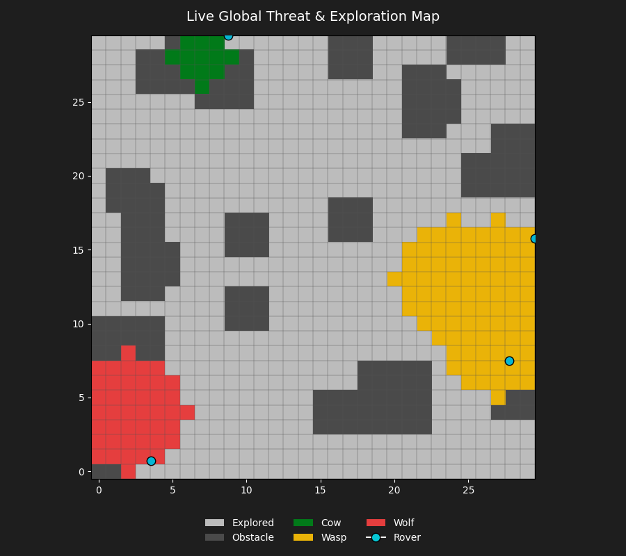
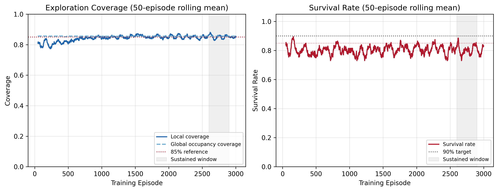
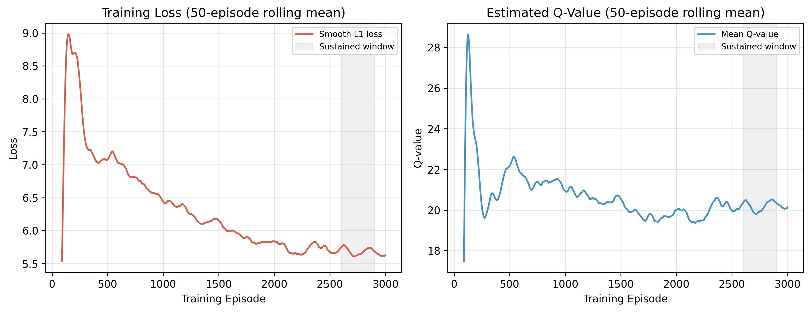
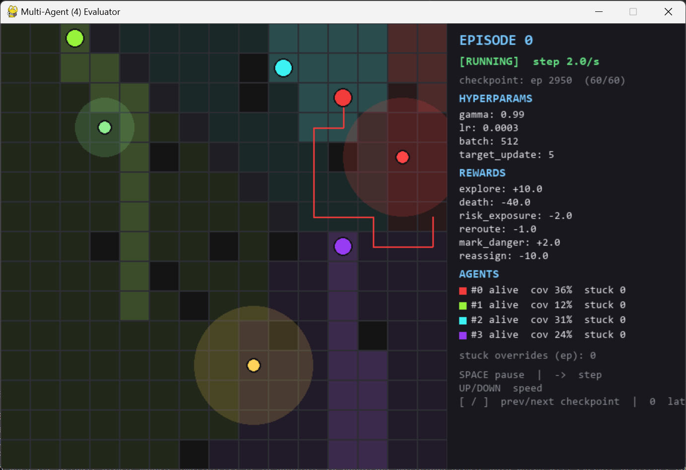
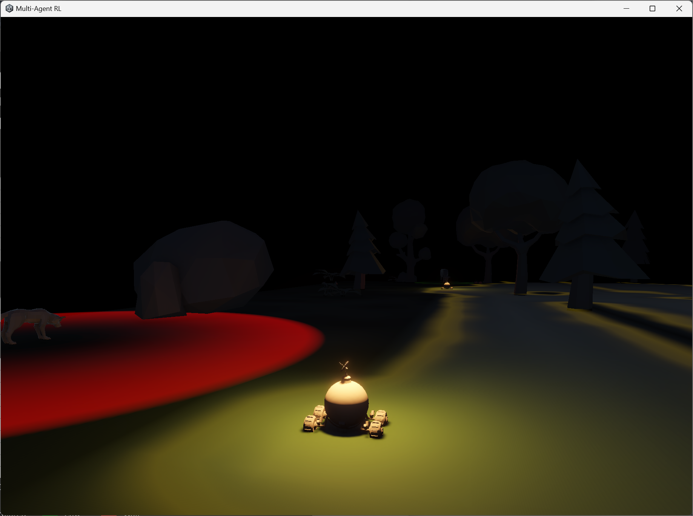

# Risk-Aware Semi-Centralized Multi-Agent Exploration System in Unknown Environments

[](https://www.python.org/)
[](https://unity.com/)
[](https://pytorch.org/)
[](https://fastapi.tiangolo.com/)
[](https://scipy.org/)

> **Academic Implementation Companion**  
> Based on the research paper:  
> **"Risk-Aware Semi-Centralized Multi-Agent Exploration System in Unknown Environments"**  
> *Vishnu Gowda H C, S S Darshan Hegde, Sarvotham B M, Rahul Dev C*  
> Under the Guidance of: *Prof. Thanuja M*, Department of Information Science and Engineering, Sai Vidya Institute of Technology, Visvesvaraya Technological University (VTU), Bengaluru, India.

---

## Table of Contents
1. [Overview & Core Contributions](#overview--core-contributions)
2. [System Architecture](#system-architecture)
3. [Communication Bridge & Protocols](#communication-bridge--protocols)
4. [Threat Generalization Framework](#threat-generalization-framework)
5. [Reinforcement Learning & Decision Engine](#reinforcement-learning--decision-engine)
6. [Spatial Coordination & Resilient Algorithms](#spatial-coordination--resilient-algorithms)
7. [Empirical Results & Convergence](#empirical-results--convergence)
8. [Visual Telemetry & Paper Figures](#visual-telemetry--paper-figures)
9. [Repository File Structure](#repository-file-structure)
10. [Setup & Execution Guide](#setup--execution-guide)
11. [Configuration Reference](#configuration-reference)
12. [Paper Roadmap & Limitations](#paper-roadmap--limitations)
13. [Citation](#citation)

---

## Overview & Core Contributions

Autonomous exploration of unknown, hazardous environments requires balancing two inherently conflicting objectives:
1. **Maximizing spatial coverage speed** across uncharted frontiers.
2. **Minimizing agent attrition** against discrete, fatal environmental hazards.

Traditional exploration systems typically gravitate to one of two extremes:
- **Fully centralized architectures**: Achieve globally optimal task distribution (e.g., Voronoi partitioning) but present a catastrophic single point of failure.
- **Fully decentralized swarms**: Resilient against individual node failure, but suffer from redundant coverage, lack fleet-wide state tracking, and treat environmental threats as binary obstacles or ignore them outright.

This repository implements the complete end-to-end framework presented in the paper: a **risk-aware, semi-centralized multi-agent system** uniting a persistent Python intelligence and coordination backend with a real-time Unity 3D physical actuation environment.

```
┌─────────────────────────────────────────────────────────────────────────┐
│                           CENTRAL COORDINATOR                           │
│  - Master Occupancy Grid (30x30)        - Global Risk Map               │
│  - Voronoi Partitioning Engine          - Failure & Reassignment Engine │
│  - Heartbeat Liveness Monitor           - WebSocket Dispatcher          │
└────────────────────────────────────┬────────────────────────────────────┘
                                     │  WebSocket (ws://127.0.0.1:8000/ws)
                                     ▼
┌─────────────────────────────────────────────────────────────────────────┐
│                         PER-AGENT HANDLER SERVICE                       │
│  - Multiplexed AgentTask Inboxes        - RiskScorer & PerceptionClassifier│
│  - Double DQN Inference Policy (4-dim)  - Hazard-Weighted A* Planner    │
│  - Risk-Filtered Frontier Selection     - Asynchronous Global Visualizer│
└────────────────────────────────────┬────────────────────────────────────┘
                                     │  WebSocket (ws://127.0.0.1:8766)
                                     ▼
┌─────────────────────────────────────────────────────────────────────────┐
│                       UNITY 3D ACTUATION LAYER                          │
│  - Rigidbody Physics & Kinematics       - Dynamic Volumetric Fog-of-War │
│  - OverlapSphere Hazard Sensing         - Voronoi Zone Raycast Visualizer│
│  - Deterministic Stuck Detection (1.5s) - Rover Camera Tracking (Keys 1-4)│
└─────────────────────────────────────────────────────────────────────────┘
```

### Key Contributions Backed by the Implementation
1. **Four-Tier Semi-Centralized Architecture**: Strategic coordination (occupancy grid, Voronoi partitioning, failure reallocation) lives in a central service, while tactical hazard response runs autonomously per agent.
2. **Domain-Agnostic Threat Generalization**: Hazards are encoded as a continuous three-axis feature vector (**lethality, radius, persistence**) loaded from external configuration (`backend/config/threats/jungle_demo.yml`), completely decoupling semantic object definitions from decision logic.
3. **Double DQN Threat-Response Policy with Architectural Safety**: Value-based Double DQN policy invoked *only* upon hazard detection. The action space is strictly bounded to 4 discrete actions (`CONTINUE`, `REROUTE`, `MARK_DANGER`, `REQUEST_REASSIGNMENT`), having architecturally eliminated degenerate stalling behaviors (`Hold`).
4. **End-to-End Sim-to-Engine Validation**: The policy is trained headless in a fast 2D sandbox (`TrainingSandboxEnv`) sharing identical backend classes, frozen at episode 3000 (`framework_v1_final.pt`), and deployed live into a 3D Unity scene without fine-tuning.

---

## System Architecture

The codebase maps directly to the paper's four-tier operational division:

| Architectural Tier | Functional Responsibilities | Codebase Implementation |
| :--- | :--- | :--- |
| **Central Coordinator** | Global state authority: 30x30 master occupancy grid, unified threat map, Voronoi zone generator, dynamic orphan-cell reassignment, heartbeat monitor. | [`backend/coordinator/main.py`](file:///E:/Projects/Projects/Multi-Agent/backend/coordinator/main.py)<br>[`backend/coordinator/voronoi_partition.py`](file:///E:/Projects/Projects/Multi-Agent/backend/coordinator/voronoi_partition.py)<br>[`backend/coordinator/reassignment.py`](file:///E:/Projects/Projects/Multi-Agent/backend/coordinator/reassignment.py)<br>[`backend/coordinator/occupancy_grid.py`](file:///E:/Projects/Projects/Multi-Agent/backend/coordinator/occupancy_grid.py)<br>[`backend/coordinator/risk_map.py`](file:///E:/Projects/Projects/Multi-Agent/backend/coordinator/risk_map.py) |
| **Resilient Mesh Layer** | Peer-to-peer fail-safe fallback governed by a dead-man's-switch. Monitors coordinator liveness and triggers direct distance reassignment upon coordinator timeout. | [`backend/coordinator/heartbeat_monitor.py`](file:///E:/Projects/Projects/Multi-Agent/backend/coordinator/heartbeat_monitor.py)<br>[`backend/coordinator/ws_server.py`](file:///E:/Projects/Projects/Multi-Agent/backend/coordinator/ws_server.py) |
| **Agent Intelligence** | Distributed decision stack per rover: sensor-tag classification, continuous risk scoring, risk-aware frontier search, hazard-weighted A*, and Double DQN threat resolution. | [`backend/handler/agent_task.py`](file:///E:/Projects/Projects/Multi-Agent/backend/handler/agent_task.py)<br>[`backend/handler/rl_policy.py`](file:///E:/Projects/Projects/Multi-Agent/backend/handler/rl_policy.py)<br>[`backend/handler/pathfinder.py`](file:///E:/Projects/Projects/Multi-Agent/backend/handler/pathfinder.py)<br>[`backend/handler/risk_scorer.py`](file:///E:/Projects/Projects/Multi-Agent/backend/handler/risk_scorer.py)<br>[`backend/handler/perception_classifier.py`](file:///E:/Projects/Projects/Multi-Agent/backend/handler/perception_classifier.py) |
| **Actuation & Environment** | 3D rendering, continuous rigidbody kinematics, terrain collision, OverlapSphere hazard detection, dynamic fog-of-war shaders, and camera tracking. No decision logic. | [`Unity/Assets/Scripts/AgentController.cs`](file:///E:/Projects/Projects/Multi-Agent/Unity/Assets/Scripts/AgentController.cs)<br>[`Unity/Assets/Scripts/SensorController.cs`](file:///E:/Projects/Projects/Multi-Agent/Unity/Assets/Scripts/SensorController.cs)<br>[`Unity/Assets/Scripts/FogOfWarManager.cs`](file:///E:/Projects/Projects/Multi-Agent/Unity/Assets/Scripts/FogOfWarManager.cs)<br>[`Unity/Assets/Scripts/VoronoiVisualizer.cs`](file:///E:/Projects/Projects/Multi-Agent/Unity/Assets/Scripts/VoronoiVisualizer.cs)<br>[`Unity/Assets/Scripts/NetClient.cs`](file:///E:/Projects/Projects/Multi-Agent/Unity/Assets/Scripts/NetClient.cs) |

<!-- PLACEHOLDER: FIGURE 1 -->
### Architecture Overview
<p align="center">
  
</p>
<p align="center"><em>Figure 1: Four-tier system architecture showing the Central Coordinator, Resilient Mesh Layer, distributed Agent Intelligence modules, and Unity actuation environment connected via the asynchronous WebSocket bridge.</em></p>

---

## Communication Bridge & Protocols

Inter-process communication is decoupled across two independent WebSocket connections transporting serialized JSON envelopes:

```
[Unity Actuation Layer] 
       ▲
       │  ws://127.0.0.1:8766 (NetClient.cs ↔ handler_service.py)
       ▼
[Handler Service (AgentTasks)]
       ▲
       │  ws://127.0.0.1:8000/ws (comms_client.py ↔ ws_server.py)
       ▼
[Coordinator Service (FastAPI)]
```

### JSON Message Schemas
All messages adhere to a standardized envelope:
```json
{
  "type": "string",
  "agent_id": 0,
  "timestamp": 1786118375.91,
  "payload": {}
}
```

- **`handler_ready`** (`Handler → Coordinator`): Broadcasts initial rover grid coordinates upon Unity scene boot to trigger initial Voronoi zone generation.
- **`zone_assignment`** (`Coordinator → Handler`): Delivers assigned coordinate arrays `[{"x": int, "z": int}]` per agent.
- **`waypoint_list`** (`Handler → Unity`): Pushes world-space target waypoints `[{"x": float, "z": float}]` calculated by A*.
- **`sensor_detection`** (`Unity → Handler`): Emitted by [`SensorController.cs`](file:///E:/Projects/Projects/Multi-Agent/Unity/Assets/Scripts/SensorController.cs) when an entity enters the 8-meter detection sphere. Contains `tags`, `distance`, and local `hazard_pos`.
- **`threat_broadcast`** (`Handler → Coordinator`): Emitted when an agent picks action `MARK_DANGER`, distributing hazard coordinates and risk scalar to the coordinator's global risk map.
- **`agent_stuck`** (`Unity → Handler`): Fired when horizontal velocity remains below 0.15 m/s for 1.5 seconds or more, triggering deterministic target marking as impassable and forced replanning.
- **`heartbeat` / `heartbeat_ack`** (`Handler ↔ Coordinator`): Sent every 500 ms. If 6 consecutive heartbeats are missed (3.0 s window), timeout logging occurs.

---

## Threat Generalization Framework

Hazards are never hard-coded into the intelligence stack. Danger is evaluated through a 4-stage processing pipeline:

```
[Stage 1: Raw Sensor Perception]
  Tag ("wolf", "wasp", "cow"), Distance (m), Detection Confidence
                  │
                  ▼
[Stage 2: External Configuration Lookup]
  backend/config/threats/jungle_demo.yml
                  │
                  ▼
[Stage 3: Threat Feature Vector Construction]
  Features = { Lethality: [0.0, 1.0], Radius: r (cells), Persistence: "static" }
                  │
                  ▼
[Stage 4: Distance-Based Risk Scoring]
  Computes continuous risk scalar based on lethality, distance decay, and blast radius
```

### Evaluated Threat Profiles (`backend/config/threats/jungle_demo.yml`)
As evaluated in Section IV and Table I of the paper:

| Entity Tag | Lethality | Blast Radius | Persistence | Tactical Behavior |
| :--- | :---: | :---: | :---: | :--- |
| **`wolf`** | `0.85` | `4.0` cells | `static` | High-lethality threat. Triggers immediate reroute or fleet danger broadcast. Contact has an 85% casualty probability. |
| **`wasp`** | `0.30` | `4.0` cells | `static` | Moderate threat. Inflicts continuous health degradation on proximity, penalizing prolonged path exposure. |
| **`cow`** | `0.025` | `2.0` cells | `static` | Benign ambient obstacle. Minimal risk scalar; agent policy learns to bypass or traverse without triggering disruptive fleet reassignment. |

*Note: The schema supports mobile/dynamic tracking via the `persistence` axis, but evaluated threats are stationary.*

---

## Reinforcement Learning & Decision Engine

Routine navigation is handled deterministically via classical A* search. The reinforcement learning policy is **invoked exclusively when an agent's `Threat Recognizer` flags an entity exceeding a risk threshold (> 0.02)**.

### POMDP Formulation
Tactical decision-making is framed as a Partially Observable Markov Decision Process:
- **Observation Space (6 Continuous Dimensions)**:
  Constructed in [`backend/handler/agent_task.py:L199-206`](file:///E:/Projects/Projects/Multi-Agent/backend/handler/agent_task.py#L199-L206):
  1. **Normalized X-coordinate**: Agent position along the X-axis (`x / width`).
  2. **Normalized Z-coordinate**: Agent position along the Z-axis (`z / height`).
  3. **Immediate Risk**: Non-linearly scaled risk scalar (`tanh(Risk)`).
  4. **Local Zone Coverage**: Ratio of explored cells within current assigned zone.
  5. **Agent Life Status**: Active status flag (1.0 if alive).
  6. **Threat History**: Flag indicating prior threat encounters in current zone.

- **Discrete Action Space (4 Dimensions)**:
  Defined in [`backend/handler/training_sandbox.py:L15-19`](file:///E:/Projects/Projects/Multi-Agent/backend/handler/training_sandbox.py#L15-L19):
  - **`0: CONTINUE`**: Proceed along current trajectory through the flagged cell.
  - **`1: REROUTE`**: Apply a cost multiplier (25.0x hazard cost) to the local costmap and compute a safe detour via `astar_with_hazard`.
  - **`2: MARK_DANGER`**: Emit a `threat_broadcast` to update the coordinator's global risk map, saving peer agents from redundant encounters, followed by a local reroute.
  - **`3: REQUEST_REASSIGNMENT`**: Hand the remainder of the agent's assigned zone back to the coordinator for redistribution to surviving peers.

### Architectural Elimination of the Stall Failure Mode
Earlier system iterations exposed a critical failure mode: agents utilizing a learned `Hold` action froze indefinitely when facing contaminated frontiers, allowing the agent to "hide" from death penalties while exploration stalled.
- **Architectural Solution**:
  1. `Hold` was completely excised from the action space.
  2. [`find_safe_frontier()`](file:///E:/Projects/Projects/Multi-Agent/backend/handler/pathfinder.py#L122-L151) pre-filters frontier candidates against cell risk (threshold <= 0.02) before invoking A*, guaranteeing the planner never targets a contaminated cell unless the entire zone is impassable.
  3. Stalling is handled deterministically via [`AgentController.cs`](file:///E:/Projects/Projects/Multi-Agent/Unity/Assets/Scripts/AgentController.cs): if a rover is physically stuck (velocity < 0.15 m/s for >= 1.5 s), the targeted waypoint is marked impassable (3x3 footprint) and a fresh replan is enforced.

### Reward Function Parameters (`backend/config/rewards.yml`)
Matching Section V-C and Table II of the paper:

| Event Trigger | Reward Value | Algorithmic Rationale |
| :--- | :---: | :--- |
| **New cell explored** (`r_explore`) | `+10.0` | Primary exploration driver; encourages rapid frontier discovery. |
| **Agent death** (`r_death`) | `-40.0` | Severe casualty penalty. Tuned from -50 (overly timid) and -30 (reckless attrition). |
| **Redundant cross-zone overlap** (`r_overlap`) | `-1.5` | Penalizes stepping into peer zones, preserving Voronoi separation. |
| **Forced stall-breaking reroute** (`r_unnecessary_retreat`) | `-2.0` | Discourages getting trapped in physical geometry. |
| **Medium risk exposure** (`r_risk_exposure`) | `-2.0` | Penalizes lingering in active hazard blast radii. |
| **Reroute penalty** (`r_reroute_penalty`) | `-1.0` | Small cost on path deviation to avoid unnecessary detours. |
| **Mark danger broadcast** (`r_mark_danger`) | `+2.0` | Cooperative bonus; rewards sharing threat intelligence with the fleet. |
| **Request reassignment** (`r_reassignment`) | `-10.0` | Expensive penalty; zone offloading is reserved as a last resort. |

### Double DQN Architecture & Hyperparameters
Implemented in [`backend/handler/rl_policy.py`](file:///E:/Projects/Projects/Multi-Agent/backend/handler/rl_policy.py):
- **Network**: Multi-Layer Perceptron (Input: 6 → Dense(64) → ReLU → Dense(64) → ReLU → Output: 4).
- **Optimizer**: Adam (learning rate = 0.0003).
- **Loss**: Smooth L1 (Huber Loss) with gradient clipping norm 10.0.
- **Discount Factor**: 0.99.
- **Replay Buffer**: 50,000 transitions; sampled in batches of 512.
- **Target Network Update**: Every 5 episodes (`ep % 5 == 0`).
- **Exploration Schedule (Epsilon)**: Linear decay from 1.0 to 0.05 over the first 33% of episodes (~950 episodes), then locked at 0.05.

---

## Spatial Coordination & Resilient Algorithms

### 1. Polygon-Based Voronoi Partitioning
Implemented in [`backend/coordinator/voronoi_partition.py`](file:///E:/Projects/Projects/Multi-Agent/backend/coordinator/voronoi_partition.py). Rather than relying on simple Euclidean nearest-neighbor approximations, the system builds true Voronoi polygons across active agent seed positions using `scipy.spatial.Voronoi`:
- Bounding dummy vertices constrain infinite Voronoi ridges within the grid domain.
- Polygons are evaluated using `matplotlib.path.Path.contains_point()` to assign unexplored cells discretely without boundary contention.

### 2. Failure Recovery & Dynamic Reassignment
Implemented in [`backend/coordinator/reassignment.py`](file:///E:/Projects/Projects/Multi-Agent/backend/coordinator/reassignment.py). When an agent is eliminated or requests reassignment:
1. The coordinator computes the geometric centroid of the orphaned cells.
2. The nearest active agent is identified by minimum Euclidean distance to the orphaned centroid.
3. A complete global Voronoi re-partition is triggered across the surviving fleet, smoothly absorbing the orphaned territory without stalling the exploration mission.

### 3. Hazard-Weighted A* Pathfinding
Implemented in [`backend/handler/pathfinder.py`](file:///E:/Projects/Projects/Multi-Agent/backend/handler/pathfinder.py). When detouring around threats, the step cost dynamically accounts for both travel distance and the continuous danger field, applying a 25.0x hazard weighting to steer rovers safely around threat blast radii.

---

## Empirical Results & Convergence

The complete training run was conducted over **3,000 headless episodes** in [`TrainingSandboxEnv`](file:///E:/Projects/Projects/Multi-Agent/backend/handler/training_sandbox.py) (15x15 grid, 12 obstacles, 3 hazards, 4 rovers). Performance metrics are verified against the saved log file [`logs/training_metrics.csv`](file:///E:/Projects/Projects/Multi-Agent/logs/training_metrics.csv).

### Sustained Performance (Episodes 2600–2900)
Verified against Table III of the research paper:

| Evaluation Metric | Measured Mean Value | Convergence Characteristic |
| :--- | :---: | :--- |
| **Mean Local Coverage** | **85.1%** | High intra-zone exploration completeness across all 4 rovers. |
| **Mean Global Occupancy Coverage** | **85.6%** | Collective fleet coverage of the entire obstacle-free environment. |
| **Mean Survival Rate** | **85.0%** | Sustained survivability under lethal hazards (discrete 0%, 25%, 50%, 75%, 100% steps). |
| **Mean Training Loss (Smooth L1)** | **5.68** | Loss function fully converged by episode 1800 with zero divergence. |
| **Mean Q-Value** | **20.2** | Estimated expected return stabilized cleanly without overestimation bias. |
| **Total Evaluated Episodes** | **3,000** | Checkpoints saved every 50 episodes to `backend/handler/checkpoints/`. |

---

## Visual Telemetry & Paper Figures

Below are dedicated placeholders for all visual telemetry and figures featured in the paper. To populate these images, place your exported figures or screenshots into the `docs/` folder using the indicated file names.

---

### Figure 2: Coordinator Global Occupancy & Threat Map
<!-- PLACEHOLDER: FIGURE 2 -->
<p align="center">
  
</p>
<p align="center">
  <em><strong>Figure 2: Global Threat & Occupancy Map.</strong> Explored cells are rendered in light gray, obstacles in dark gray, and unexplored cells within a hazard's blast radius are colored by threat tag (Wolf: Red, Wasp: Yellow, Cow: Green). Active rover coordinates are plotted as cyan markers.</em><br>
  <code>File destination: docs/fig2_global_threat_map.png</code>
</p>

---

### Figure 3: Training Trajectory (Coverage & Survival)
<!-- PLACEHOLDER: FIGURE 3 -->
<p align="center">
  
</p>
<p align="center">
  <em><strong>Figure 3: Training Trajectory across 3,000 Episodes (50-Episode Rolling Mean).</strong> Illustrates local coverage (85.1%), global occupancy coverage (85.6%), and fleet survival rate (85.0%) settling cleanly past episode 2,000 as epsilon reaches its 0.05 floor.</em><br>
  <code>File destination: docs/fig3_training_trajectory.png</code>
</p>

---

### Figure 4: Loss & Q-Value Convergence
<!-- PLACEHOLDER: FIGURE 4 -->
<p align="center">
  
</p>
<p align="center">
  <em><strong>Figure 4: Double DQN Loss & Q-Value Evolution.</strong> Smooth L1 loss stabilizes to ~5.68 and mean Q-value plateaus at ~20.2 between episodes 1,800–2,000, demonstrating absence of Q-value overestimation bias.</em><br>
  <code>File destination: docs/fig4_loss_qvalue.png</code>
</p>

---

### Figure 5: Dynamic Reassignment During Agent Attrition
<!-- PLACEHOLDER: FIGURE 5 -->
<p align="center">
  
</p>
<p align="center">
  <em><strong>Figure 5: Failure Recovery under Agent Loss (Checkpoint 2950).</strong> Left: Early episode state with all 4 agents active (12–36% coverage). Right: Late episode state after agents #0 and #3 are eliminated. The coordinator dynamically redistributes orphaned Voronoi zones to surviving rovers, climbing to 50–93% coverage without freezing.</em><br>
  <code>File destination: docs/fig5_failure_recovery.png</code>
</p>

---

### Figure 6: Live 3D Unity Actuation & Fog-of-War
<!-- PLACEHOLDER: FIGURE 6 -->
<p align="center">
  
</p>
<p align="center">
  <em><strong>Figure 6: Live Deployment in Unity 3D with Universal Render Pipeline (URP).</strong> Left: Rover exploring under volumetric fog-of-war with an ambient Cow near torch range. Right: Rover encountering a classified Wolf hazard, triggering dynamic danger radius visualization and a hazard-weighted detour.</em><br>
  <code>File destination: docs/fig6_unity_live_deployment.png</code>
</p>

---

## Repository File Structure

```text
Multi-Agent/
├── Launch.bat                         # Automated Windows launcher (FastAPI Coordinator + Handler)
├── requirements.txt                   # Python dependencies (FastAPI, PyTorch, Scipy, Pygame, etc.)
├── python_telemetry.csv               # Live runtime telemetry (positions, events, RL decisions)
├── README.md                          # Comprehensive project documentation
│
├── backend/                           # Python intelligence & coordination stack
│   ├── config/
│   │   ├── rewards.yml                # Reward shaping parameters & DQN hyperparameters
│   │   └── threats/
│   │       └── jungle_demo.yml        # Threat feature vectors (wolf, wasp, cow profiles)
│   │
│   ├── coordinator/                   # Central Strategic Authority (FastAPI + WebSockets)
│   │   ├── main.py                    # Coordinator service entrypoint (Port 8000/ws)
│   │   ├── ws_server.py               # Asynchronous WebSocket message dispatcher
│   │   ├── occupancy_grid.py          # 30x30 discrete global occupancy grid
│   │   ├── risk_map.py                # Fleet-wide hazard exposure & danger broadcast map
│   │   ├── voronoi_partition.py       # Scipy-based polygon Voronoi zone partitioner
│   │   ├── reassignment.py            # Orphaned zone reallocation & nearest-agent solver
│   │   ├── agent_registry.py          # Live agent state, positions, and life tracking
│   │   ├── heartbeat_monitor.py       # Dead-man's-switch liveness auditor (500ms / 3.0s window)
│   │   └── metrics_analyzer.py        # Post-run metrics and performance evaluation
│   │
│   └── handler/                       # Distributed Tactical Agent Intelligence
│       ├── handler_service.py         # Multi-agent handler process (Port 8766 for Unity)
│       ├── agent_task.py              # Per-agent decision loop, state assembly, & dispatch
│       ├── rl_policy.py               # Double DQN neural network & experience replay agent
│       ├── pathfinder.py              # A*, hazard-weighted A*, & risk-filtered frontier search
│       ├── risk_scorer.py             # Continuous inverse-square distance risk formula
│       ├── perception_classifier.py   # Raw sensor tag to threat feature vector mapper
│       ├── comms_client.py            # Low-latency WebSocket client to coordinator
│       ├── replay_buffer.py           # 50,000-sample experience replay buffer
│       ├── training_sandbox.py        # Headless 15x15 2D simulation environment
│       ├── train.py                   # 3,000-episode training pipeline with epsilon decay
│       ├── pygame_visualizer.py       # Interactive 2D headless visualizer with hotkeys
│       ├── global_visualizer.py       # Matplotlib real-time live tactical map
│       └── checkpoints/               # Saved PyTorch models (framework_v1_final.pt, etc.)
│
├── Unity/                             # Unity 3D Actuation Layer (Unity 6000.x URP)
│   ├── Assets/
│   │   ├── Scripts/
│   │   │   ├── AgentController.cs     # Rigidbody physics movement & 1.5s stuck detection
│   │   │   ├── SensorController.cs    # OverlapSphere 8m detection & grid transform
│   │   │   ├── NetClient.cs           # WebSocket client to handler (ws://127.0.0.1:8766)
│   │   │   ├── TerrainManager.cs      # 30x30 grid origin, obstacles, & cell updates
│   │   │   ├── FogOfWarManager.cs     # Dynamic R8 texture fog-of-war vision mask
│   │   │   ├── VoronoiVisualizer.cs   # Ground raycasting & colored zone boundary quads
│   │   │   ├── HazardVisualizer.cs    # In-game hazard danger radius rendering
│   │   │   ├── RoverCameraTracker.cs  # Smooth follow camera with target hotkeys (Keys 1-4)
│   │   │   ├── TelemetryLogger.cs     # Real-time event logging to CSV
│   │   │   ├── UnityMainThreadDispatcher.cs # Thread-safe WebSocket action execution
│   │   │   └── Wheels.cs              # Wheel rotation kinematics
│   │   └── Material/                  # URP Shaders, Fog-of-War shaders, & zone materials
│   └── ProjectSettings/               # InputSystem & URP project settings
│
├── BuildFile/                         # Standalone Pre-Built Windows Executable
│   ├── Multi-Agent RL.exe             # Direct executable (no Unity Editor required)
│   └── UnityPlayer.dll                # Unity 6000 runtime engine
│
├── docs/                              # Diagrams, figures, and publication assets
│   ├── RL.jpg                         # Figure 1: Architecture diagram
│   ├── fig2_global_threat_map.png     # Figure 2: Occupancy & threat map
│   ├── fig3_training_trajectory.png   # Figure 3: Coverage & survival trajectory
│   ├── fig4_loss_qvalue.png           # Figure 4: Loss & Q-value convergence curves
│   ├── fig5_failure_recovery.png      # Figure 5: Dynamic zone reassignment
│   └── fig6_unity_live_deployment.png # Figure 6: Live 3D Unity deployment
│
└── logs/                              # Experimental logs & empirical data
    └── training_metrics.csv           # 3,000 episodes of verified empirical data
```

---

## Setup & Execution Guide

### Prerequisites
- **Operating System**: Windows 10/11 (assumed by `Launch.bat`; Linux/macOS supported via manual terminal commands).
- **Python**: `3.12.x` (verified with `py -3.12`).
- **Unity**: `6000.x` with Universal Render Pipeline (URP) template (required only for editing the 3D scene; not needed if using the standalone build).
- **Unity Packages**: `com.unity.inputsystem` (New Input System) and `Newtonsoft.Json`.

### 1. Installation
Clone the repository and install the Python dependencies into a virtual environment:

```bash
git clone https://github.com/VishnuGowdaHC/Multi-Agent_Exploration_System_Using_RL.git
cd Multi-Agent

# Create and activate Python 3.12 virtual environment
py -3.12 -m venv .venv
.venv\Scripts\activate          # Windows PowerShell / CMD
# source .venv/bin/activate     # macOS / Linux

# Install required packages
pip install -r requirements.txt
```

---

### 2. Execution Modes

#### Mode A: Quickstart via Standalone Windows Build (Recommended)
You do not need to install Unity to test the full 3D simulation.
1. Run [`Launch.bat`](file:///E:/Projects/Projects/Multi-Agent/Launch.bat) (or start the services manually):
   ```cmd
   py -3.12 -m fastapi dev backend/coordinator/main.py
   py -3.12 -m backend.handler.handler_service
   ```
2. Launch the standalone binary:
   ```cmd
   BuildFile\Multi-Agent RL.exe
   ```
3. The rovers automatically register with the backend, receive their Voronoi zones, and initiate autonomous exploration.

#### Mode B: Development Execution via Unity Editor
1. Start both Python backend services using [`Launch.bat`](file:///E:/Projects/Projects/Multi-Agent/Launch.bat).
2. Open Unity Hub, select **Add project from disk**, and point to the `Unity/` folder.
3. Open the main exploration scene. Verify that `NetClient` has `serverUri` set to `ws://127.0.0.1:8766`.
4. Press **Play**.
5. **In-Editor Controls**:
   - `1`, `2`, `3`, `4`: Switch follow camera between Rover 0, Rover 1, Rover 2, and Rover 3 ([`RoverCameraTracker.cs`](file:///E:/Projects/Projects/Multi-Agent/Unity/Assets/Scripts/RoverCameraTracker.cs)).

#### Mode C: Interactive 2D Headless Visualizer
To observe the trained policy navigating the 2D sandbox without launching Unity:
```bash
python -m backend.handler.pygame_visualizer
```
**Keyboard Controls**:
| Key | Action |
| :---: | :--- |
| `Space` | Pause / Unpause simulation |
| `→` (Right Arrow) | Step forward single simulation tick when paused |
| `↑` / `↓` (Up / Down) | Increase / Decrease simulation speed (ticks per second) |
| `[` / `]` | Step backward / forward through saved checkpoints in `checkpoints/` |
| `0` | Reload the latest final checkpoint (`framework_v1_final.pt`) |

---

### 3. Training Policy from Scratch
To retrain the Double DQN threat module across 3,000 episodes:
```bash
python -m backend.handler.train
```
- Progress, action distributions, Q-values, and loss are streamed live to the console every 50 episodes.
- Checkpoints are saved to `backend/handler/checkpoints/framework_v1_ep_<ep>.pt`.
- Real-time performance metrics are logged to `logs/training_metrics.csv`.

---

## Configuration Reference

### Reward & Hyperparameter Tuning (`backend/config/rewards.yml`)
```yaml
rewards:
  r_explore: 10.0               # Reward per newly uncovered grid cell
  r_death: -40.0                # Penalty on agent casualty
  r_overlap: -1.5               # Penalty for traversing peer Voronoi zones
  r_unnecessary_retreat: -2.0   # Penalty for getting stuck
  r_risk_exposure: -2.0         # Penalty for remaining in hazard blast radii
  r_reroute_penalty: -1.0       # Cost penalty on detour path recomputation
  r_mark_danger: 2.0            # Cooperative bonus for broadcasting threat data
  r_reassignment: -10.0         # Penalty for returning zone to coordinator

hyperparameters:
  gamma: 0.99                   # Discount factor
  learning_rate: 0.0003         # Adam optimizer learning rate
  buffer_size: 50000            # Experience replay memory capacity
  batch_size: 512               # Minibatch sample size
  target_update_every: 5        # Frequency (episodes) of target network weight sync
```

### Threat Configuration Profiles (`backend/config/threats/jungle_demo.yml`)
```yaml
wolf:
  lethality: 0.85
  radius: 4.0
  persistence: "static"

cow:
  lethality: 0.025
  radius_m: 2.0
  persistence: "static"

wasp:
  lethality: 0.30
  radius_m: 4.0
  persistence: "static"
```

---

## Paper Roadmap & Limitations

### Status Against Section VII Future Work
- [x] **3D Continuous Actuation Layer**: Implemented in Unity 6000 URP with rigidbody physics and soft-edge volumetric fog-of-war.
- [x] **Decoupled Asynchronous Communication**: Independent WebSocket links for Coordinator, Handler, and Actuation.
- [x] **True Multi-Agent Polygon Voronoi Partitioning**: Implemented via `scipy.spatial.Voronoi` with boundary dummy vertices.
- [x] **Architectural Stall Elimination**: Removal of `Hold` action and integration of `find_safe_frontier`.
- [ ] **Resilient Mesh Layer Active Takeover**: The heartbeat monitor (`heartbeat_monitor.py`) tracks missed acks (3.0s timeout), but automated peer-to-peer ad-hoc socket mesh migration remains future work.
- [ ] **Dynamic & Mobile Hazards**: The persistence axis schema supports mobile threats, but evaluated profiles in `jungle_demo.yml` are stationary.


