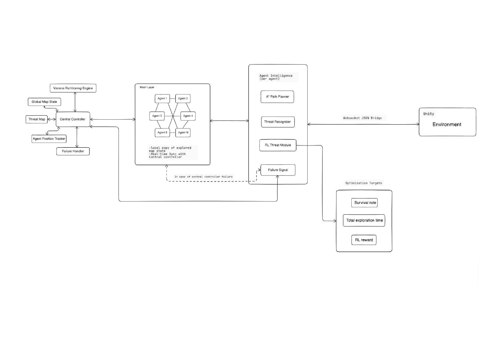

# Risk-Aware Semi-Centralized Multi-Agent Exploration System

A multi-agent exploration and hazard-avoidance simulation that pairs a Unity
3D actuation layer with a Python intelligence stack: a central coordinator
for global strategy (occupancy grid, risk map, Voronoi zone partitioning)
and per-agent handlers for local tactics (A* pathfinding, a Double DQN
risk-response policy). This repository is the implementation companion to
our paper:


## Architecture

<p align="center">
  
</p>

The system is organized into four operational layers, as proposed in the
paper (Section III):

| Layer | Role | Where it lives here |
|---|---|---|
| **Central Coordinator** | Global state manager: occupancy map, unified threat map, agent position tracker, Voronoi Partitioning Engine, Failure Handler | `backend/coordinator/` |
| **Resilient Mesh Layer** | Peer-to-peer fail-safe that takes over via a dead-man's-switch (missed heartbeats) if the coordinator goes down | `backend/coordinator/heartbeat_monitor.py` (detection only — mesh takeover is future work, see below) |
| **Agent Intelligence** | Per-agent A* planner, Threat Recognizer, and RL Threat Module (Double DQN) — invoked only when a hazard is detected | `backend/handler/` (`agent_task.py`, `pathfinder.py`, `rl_policy.py`) |
| **Actuation & Environment** | 3D rendering, physics, sensing, and fog-of-war — no decision-making logic | `Unity/` |

Inter-layer communication is WebSocket + JSON end to end, matching the
paper's Communication Bridge design (Section III-E):

```
Unity (rovers, physics, fog-of-war)
        |  WebSocket  ws://127.0.0.1:8766
        v
Handler Service  (backend/handler)
  - one AgentTask per rover: A* pathfinding + Double DQN risk decisions
        |  WebSocket  ws://127.0.0.1:8000/ws
        v
Coordinator Service  (backend/coordinator, FastAPI)
  - global occupancy grid, risk map, Voronoi zone assignment, reassignment,
    heartbeat monitoring
```

### Threat generalization

Hazards are never hard-coded. Each is described by a four-axis feature
vector — **lethality, radius, persistence, detectability** — supplied via
external config and turned into a single risk scalar (`RiskScorer`) that
decays with the inverse square of distance. Swap `backend/config/threats/*.yml`
to retarget the system at a new environment without touching decision logic
(a new distribution of threats still needs its own training pass, as noted
in the paper).

### RL decision layer

When an agent's `Threat Recognizer` flags a hazard, the frozen/training
Double DQN policy (`backend/handler/rl_policy.py`) picks one of:
**CONTINUE**, **REROUTE** (hazard-penalized A*), **MARK_DANGER** (broadcast
to the team + reroute), or **REQUEST_REASSIGNMENT** (hand the zone back to
the coordinator). `Hold` exists in the paper's action space as a
per-tick-penalized safety valve; this implementation folds that behavior
into the stuck-detection/replan path (`AgentController` stuck timer →
`agent_stuck` → forced replan) rather than exposing it as a standing
5th action, to keep the deployed action space at 4.

## Repository layout

```
Unity/Assets/Scripts/     Rover controller, networking, fog-of-war, hazards, etc.
Unity/Assets/Material/    Fog-of-war shader/shadergraph, zone + hazard materials
backend/coordinator/      FastAPI + WebSocket coordinator (global state)
backend/handler/          Per-agent handler service, pathfinding, RL policy/training
backend/config/           rewards.yml (RL config) and threats/jungle_demo.yml (hazard profiles)
docs/                     Architecture diagram
Launch.bat                One-click launcher for both Python services (Windows)
requirements.txt          Python dependencies
```

## Requirements

- **Python 3.12** (the launch script explicitly calls `py -3.12`)
- **Unity 6000.x** with the **Universal Render Pipeline (URP)** template
  - Packages: `com.unity.inputsystem` (New Input System) and
    `Newtonsoft.Json` (used by `NetClient.cs`)
- Windows is assumed by `Launch.bat`; on macOS/Linux just run the two
  Python commands from step 3 below manually.

## Setup

### 1. Install the Python backend

```bash
git clone https://github.com/VishnuGowdaHC/Multi-Agent_Exploration_System_Using_RL.git
cd Multi-Agent

py -3.12 -m venv .venv
.venv\Scripts\activate          # Windows
# source .venv/bin/activate     # macOS/Linux

pip install -r requirements.txt
```

### 2. (Optional) Train or supply an RL checkpoint

The handler loads `backend/handler/checkpoints/framework_v1_final.pt` on
startup. If it's missing, agents still run, just with an untrained policy.

Train from scratch (reads reward/hyperparameter config from
`backend/config/rewards.yml`):

```bash
python -m backend.handler.train
```

Checkpoints are saved incrementally to `backend/handler/checkpoints/`. To
watch a checkpoint play without launching Unity:

```bash
python -m backend.handler.pygame_visualizer
```

### 3. Start the backend services

Easiest — edit the hardcoded path in `Launch.bat` to point at your clone,
then double-click it. It opens two terminal windows:

```bat
py -3.12 -m fastapi dev backend/coordinator/main.py
py -3.12 -m backend.handler.handler_service
```

Or run those two commands manually in separate terminals. Once both are up:

- Coordinator is listening on `ws://127.0.0.1:8000/ws`
- Handler is listening for Unity on `ws://127.0.0.1:8766`

### 4. Open the Unity project

1. Add the `Unity/` folder as a project in Unity Hub and open it.
2. Let Unity resolve/install packages (Input System, Newtonsoft Json, URP).
3. Confirm `NetClient` on the persistent networking object has
   `serverUri = ws://127.0.0.1:8766`.
4. Press **Play**. Once the scene starts, each rover registers itself with
   the handler, the coordinator computes an initial Voronoi split, and
   exploration begins automatically.

   You can also just open BuildFile and run Multi-Agent RL.exe if you just want to try

Useful in-editor controls:
- `1`–`4` — switch the follow camera between rovers (`RoverCameraTracker`)

## Configuration

- `backend/config/rewards.yml` — reward shaping (`r_explore`, `r_death`,
  `r_risk_exposure`, etc.) and DQN hyperparameters used by `train.py`.
- `backend/config/threats/jungle_demo.yml` — per-tag hazard profiles
  (`lethality`, `radius`) that `PerceptionClassifier` uses to score threats
  reported by Unity's `SensorController` (tags: `wolf`, `wasp`, `cow`).

## Status vs. paper roadmap

Per the paper's Section VII future-work list:

- ✅ **3D simulation and actuation** — implemented via Unity + WebSocket bridge (this repo)
- ✅ **Decoupled communication protocols** — Coordinator / Handler / Unity now run as separate WebSocket-connected processes
- ✅ **N-agent Voronoi partitioning** — `scipy.spatial.Voronoi`-based engine (`voronoi_partition.py`), not limited to the paper's N=2 nearest-neighbor case
- ⏳ **Resilient Mesh Layer / dead-man's-switch takeover** — heartbeat *detection* exists (`heartbeat_monitor.py`); peer-to-peer mesh takeover on coordinator loss is not yet implemented
- ⏳ **Non-stationary (mobile/expanding) hazards** — `persistence` axis is supported by the config schema but all current threat profiles are static

## Notes / known limitations

- The grid size (30x30) is duplicated across `TerrainManager`,
  `FogOfWarManager`, and the Python occupancy grid — keep these in sync if
  you change the map size.
- `Launch.bat` has an absolute path baked in; update it before use.
- WebSocket connections are unauthenticated — intended for local/dev use
  only, not for exposing on a public network.


